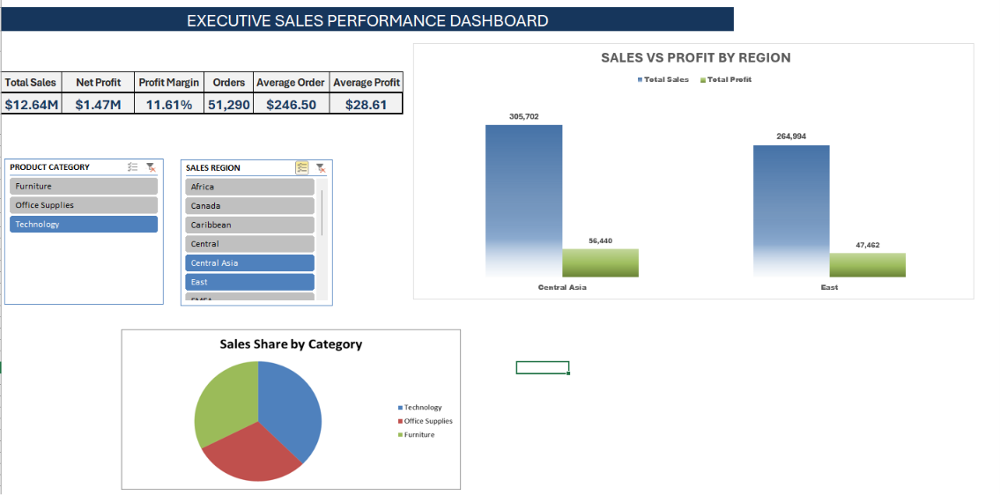

# Global Superstore Business Performance Analysis

## Dashboard Preview

> *


```

---

## Project Overview

This project was developed as part of the **Excel Skills for Business: Intermediate I** course offered by **Macquarie University**.

The objective of this project is to analyze retail sales data using Microsoft Excel and transform raw business data into meaningful insights through Pivot Tables, Pivot Charts, formulas, and an interactive dashboard.

---

## Business Problem

Retail businesses generate large volumes of sales data every day. Without proper analysis, it becomes difficult to identify profitable categories, monitor regional performance, and make informed business decisions.

This project demonstrates how Microsoft Excel can be used to organize, analyze, and visualize business data to support better decision-making.

---

## Project Objectives

- Clean and organize raw sales data
- Perform business analysis using Excel formulas
- Build dynamic Pivot Tables and Pivot Charts
- Develop an interactive dashboard
- Generate business insights and recommendations
- Present key business performance indicators (KPIs)

---

## Dataset Information

- Dataset: Global Superstore
- Industry: Retail
- Source: Kaggle
- Tool: Microsoft Excel

---

## Skills Applied

- Microsoft Excel
- Data Cleaning
- Data Analysis
- Pivot Tables
- Pivot Charts
- Conditional Formatting
- Data Visualization
- Dashboard Design
- KPI Reporting
- Business Analytics

---

## Dashboard Features

- Sales Performance Analysis
- Profit Analysis
- Regional Performance
- Category Analysis
- KPI Summary
- Interactive Filters (Slicers)
- Dynamic Pivot Charts

---

## Key Business Insights

- Technology generated the highest sales and maintained strong profitability.
- Office Supplies delivered stable business performance.
- Furniture recorded lower profit margins despite healthy sales.
- Sales and profitability varied across different regions.
- Interactive dashboards improved business performance monitoring.

---

## Business Recommendations

- Focus on high-margin product categories.
- Review pricing and discount strategies for low-margin products.
- Allocate resources to high-performing regions.
- Continue monitoring KPIs through interactive dashboards.

---

## Projected Business Impact & Value

- Supports faster business decision-making.
- Improves visibility into sales and profitability.
- Reduces manual reporting effort.
- Enables efficient KPI monitoring.
- Provides a scalable reporting solution for future business analysis.

---

## Tools Used

- Microsoft Excel
- Pivot Tables
- Pivot Charts
- Excel Formulas
- Slicers
- Conditional Formatting

---

## Repository Contents

- Business Performance Analysis Workbook (.xlsx)
- Dashboard Screenshot (.png)
- Project Report (.pdf)
- README.md

---

## Author

**Rudra Sharma**

Business Analytics | Data Analytics | Microsoft Excel

Learning through real-world business projects.
